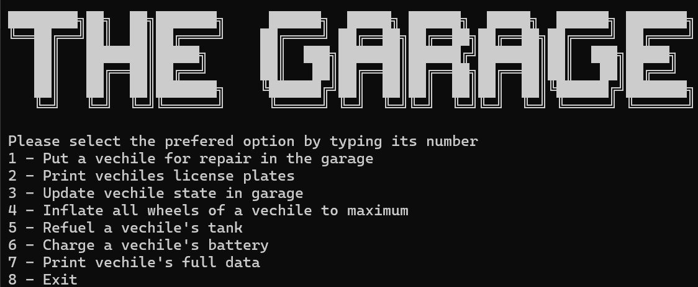
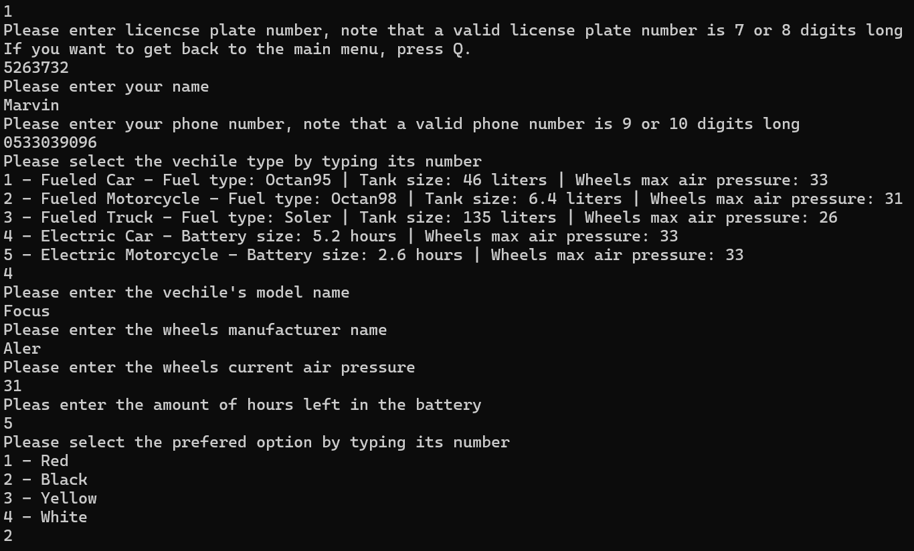
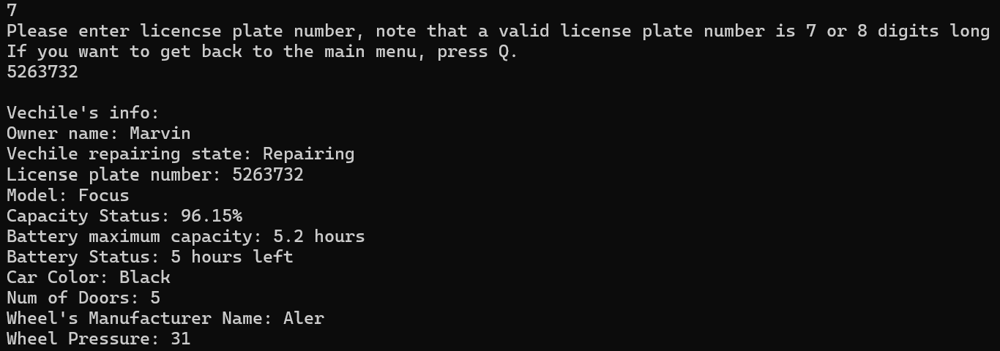

# Garage Management System

## Overview
This project is a **Garage Management System** built in **C#**, designed to manage different types of vehicles in a garage. The system provides functionalities such as adding new vehicles, changing their status, refueling or recharging, and retrieving detailed vehicle information. The project is structured with a **separation of concerns** in mind, dividing the logic and UI layers.

## Features
- Add new vehicles to the garage
- Display a list of vehicles with filtering options
- Change the status of a vehicle (In Repair, Repaired, Paid)
- Inflate vehicle tires to maximum pressure
- Refuel fuel-based vehicles with different fuel types
- Recharge electric vehicles
- Show full vehicle details

## Technologies Used
- **C#** (.NET)
- **OOP Principles** (Encapsulation, Inheritance, Polymorphism)
- **Collections** (Dictionaries, Lists)
- **Enums** (Vehicle status, fuel types)
- **Custom Exceptions**
- **Factory Design Pattern**
- **DLL Separation** (Logic and UI layers)

## Project Structure
The project consists of two separate C# projects:

### 1. Ex03.GarageLogic (Class Library)
This is the **logic layer**, containing:
- Vehicle classes (Car, Motorcycle, Truck)
- Energy types (Fuel, Electric)
- Garage management system
- Factory class for vehicle creation
- Exception handling

### 2. Ex03.ConsoleUI (Console Application)
This is the **user interface layer**, responsible for:
- Interacting with the user via a console menu
- Displaying options and handling user input
- Calling methods from `Ex03.GarageLogic`

## How to Run the Project
1. Clone the repository:
   ```sh
   git clone https://github.com/yourusername/GarageManagementSystem.git
   ```
2. Open the solution in **Visual Studio**.
3. Set `Ex03.ConsoleUI` as the startup project.
4. Run the application.

## Example Usage
```
Welcome to the Garage Management System!
1. Add a new vehicle
2. Display vehicles
3. Change vehicle status
4. Inflate tires
5. Refuel / Recharge
6. Show vehicle details
7. Exit
Select an option: _
```

## Future Improvements
- Implement a GUI-based version
- Add a database for persistent storage
- Extend support for more vehicle types

## Images

Main Menu



Putting a vechile in repair



Printing vecile's details



Status update


